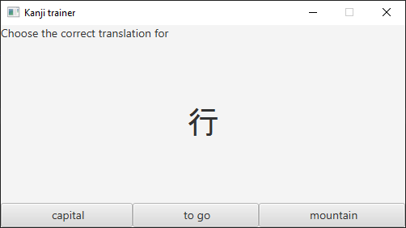
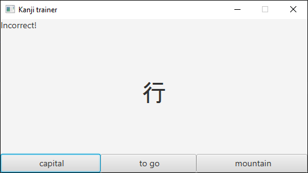
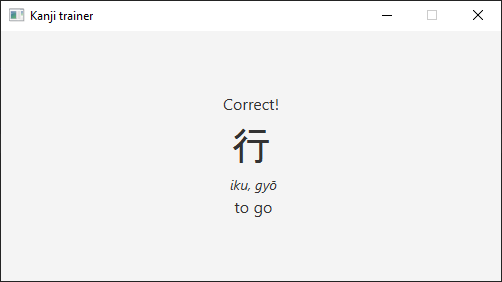
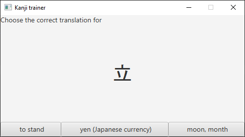

# Kanji Trainer

This is a simple Java application that helps users learn Kanji, the logographic characters used in the Japanese writing system.

## Source files

- [MainApp.java](src/main/java/kanjitrainer/MainApp.java): This is the main entry point of the application. It launches the GUI.

- [Dictionary.java](src/main/java/kanjitrainer/Dictionary.java): This class represents a dictionary of Kanji characters. It reads from a file and stores Kanji characters along with their translations and readings.

- [GUI.java](src/main/java/kanjitrainer/GUI.java): This class represents the graphical user interface of the application. It displays a random Kanji character and asks the user to choose the correct translation.

- [kanji.txt](src/main/resources/kanji.txt): This file contains the dictionary of Kanji characters. Each line contains a Kanji character, its translation and its reading, separated by a semicolon. You may add more characters to this file to expand the dictionary.

## Quick start guide (non-developers)

Download the [target](target) folder and run runme.bat.

## Screenshots

Start screen:

Click "capital":

Click "to go":

Wait a few seconds:

## License

This project is licensed under the MIT License, meaning you can use it for any purpose, commercial or non-commercial, without any restrictions.

